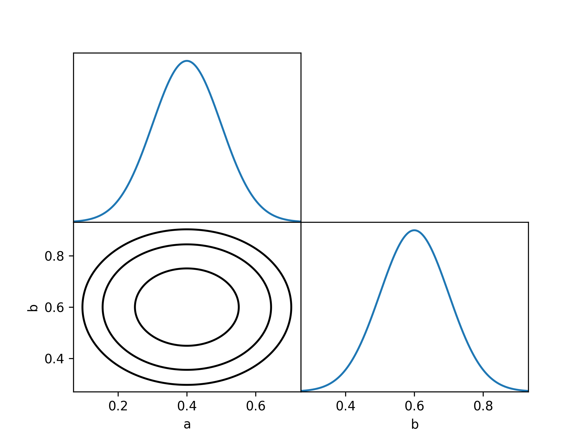

.. _user-profilers:

Profilers
=========

In addition to traditional Bayesian :ref:`sampling algorithms <user-samplers>`, `desilike` supports profiling the likelihood and/or posterior. Generally, profiling refers to the process of fixing some parameters while optimizing others to maximize the likelihood or posterior. Specifically, let's say we fix :math:`\theta_0` while optimizing all other parameters :math:`{\theta_1, \dots, \theta_n}`. We can define the profile likelihood :math:`\mathcal{L}_\mathrm{p}` of the full likelihood :math:`\mathcal{L}` as follows:

.. math::

  \mathcal{L}_\mathrm{p} (\theta_0) = \sup_{\theta_1, \dots, \theta_n} \mathcal{L} (\theta_0, \dots, \theta_n)

The profile posterior is defined analogously. While often used in Frequentist statistics, it has several practical applications.

- If no parameters are fixed, profiling implies finding the maximum likelihood or maximum a posteriori (MAP) estimate.
- Likelihood profiling is at the core of Frequentist statistics. Typically, confidence intervals for a certain parameter :math:`\theta_i` correspond to ranges where :math:`\log \mathcal{L}_\mathrm{p} (\theta_i)` is above a certain threshold :math:`\log \max \mathcal{L} - \Delta \log \mathcal{L}`.
- Profiling the posterior can be used to characterize prior volume effects. Typically, if strong prior volume effects are present, the profile posterior is very different from the marginal posterior.

In practice, `desilike` will optimize the likelihood/posterior for a given fixed combination of parameters and then interpolate those values using cubic splines.

Quickstart
----------

In the following, we will profile a simple two-dimensional Gaussian. We first have to define the fixed parameter combinations we want to optimize. Here, we choose to find the maximum a posterior value before adding one-dimensional grids in :math:`a` and :math:`b` and finally adding a two-dimensional grid for both. :meth:`~desilike.profilers.base.Profiler.run` will do the main computation and optimize all fixed points in parallel, if possible. The return object is a :class:`~desilike.statistics.samples.Samples` object and can be used to determine credible intervals and maximum a posterior and maximum likelihood estimate. Here, we choose :math:`\Delta \log \mathcal{P} = 0.5` which corresponds to the :math:`1 \sigma` interval for a one-dimensional Gaussian. Finally, we create a triangle plot of the profile posterior.

.. code-block:: python

  import numpy as np

  from desilike import profilers
  from desilike.likelihoods import BaseGaussianLikelihood
  from desilike.statistics.plotting import triangle_profile

  class Likelihood(BaseGaussianLikelihood):

      def calculate(self, **kwargs):
          self.flattheory = np.array([kwargs[name] for name in
                                      self.varied_params.names()])
          super().calculate()

  likelihood = Likelihood(np.array([0.4, 0.6]), covariance=np.eye(2) * 0.01)
  likelihood.init.params = dict(
      a=dict(prior=dict(dist='uniform', limits=[0, 1])),
      b=dict(prior=dict(dist='uniform', limits=[0, 1])))

  profiler = profilers.Profiler(likelihood, posterior=True)
  profiler.add_optimize_all()
  profiler.add_grid_manual(dict(a=np.linspace(0, 1, 5)))
  profiler.add_grid_manual(dict(b=np.linspace(0, 1, 5)))
  profiler.add_grid_manual(dict(a=np.linspace(0, 1, 5), b=np.linspace(0, 1, 4)))
  samples = profiler.run()

  print("MAP Estimates")
  for param in likelihood.varied_params.names():
      x_min, x_map, x_max = samples.interval(param, threshold=0.5)
      print(f"{param}: {x_map:.3f} ({x_min:.3f} - {x_max:.3f})")

  triangle_profile(samples, filepath='triangle.png')

This will print the (correct) MAP estimates and produce the expected profile posterior plot.

.. code-block::

  MAP Estimates
  a: 0.400 (0.300 - 0.500)
  b: 0.600 (0.500 - 0.700)

Initialization
--------------

Optimizers
----------

`desilike` provides interfaces to a variety of commonly used optimization algorithms.
